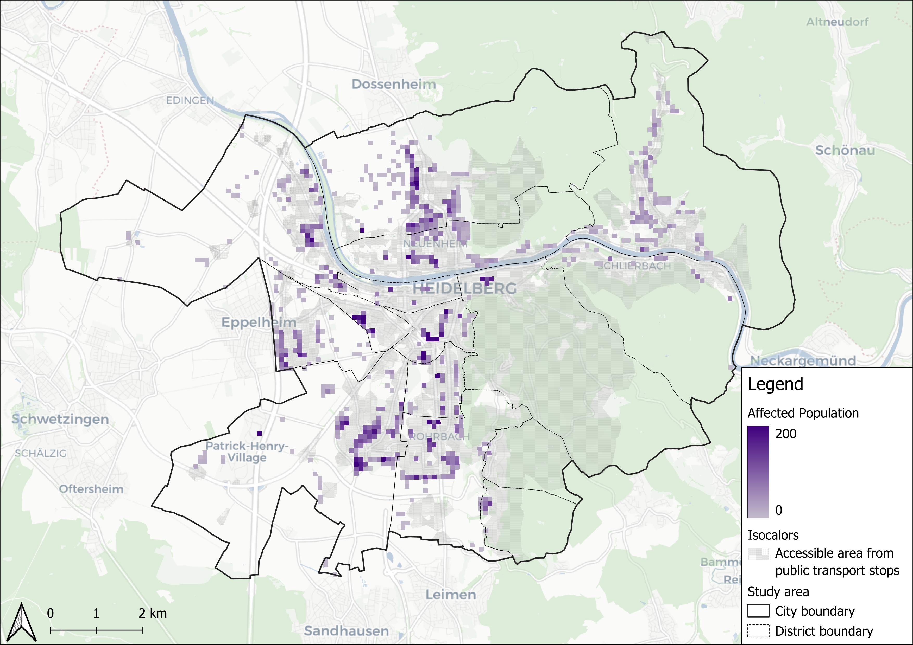

# Accessibility Analysis with Isocalors

## Introduction

This repository contains the Jupyter notebooks for conducting a accessibility analysis under heat stress conditions using isocalors. It is part of a larger project investigating the effects of heat stress on the accessibility of essential services in Heidelberg. As urban heat waves become more frequent due to climate change, it is increasingly important to understand how heat impacts access to critical services, particularly for vulnerable populations. To address this challenge, the traditional concept of isochrones—commonly used to map accessibility based on travel time—is extended by incorporating heat stress factors. This innovative approach, known as isocalor analysis, is implemented using a heat-sensitive routing tool developed by the [HEAL project](https://heal.openrouteservice.org/#/place/@8.684134483337404,49.40897673906448,12). By applying this method to the city of Heidelberg, the project provides valuable insights into how varying levels of heat stress influence access to essential health and livelihood services, offering guidance for strategies aimed at enhancing urban resilience in a warming climate.

The project consists of three main steps:
1. **Data Collection:** The first step involves collecting data on essential services, such as kindergartens, social facilities for the elderly, and trees, as well as population data and Local Climate Zones (LCZs) for Heidelberg.

2. **Isocalor Analysis:** The second step calculates isocalors for the essential services using the HEAL-API, which provides heat-sensitive routing based on OpenRouteService. The analysis considers different heat factors, heat-minute equivalents, and times of day to assess the impact of heat stress on accessibility.

3. **LCZ Analysis:** The third step uses Local Climate Zones (LCZs) to analyze the isocalors and assess the affected population by heat sensitivity factor, heat stress walking distance equivalent, and time of day. The analysis provides insights into the distribution of heat stress across different urban zones and highlights areas with high vulnerability to heat waves.

## Usage

To use this project, follow these instructions:
- Download the Jupyter Notebooks.
- Download the POI data from [Geofabrik](https://www.geofabrik.de/data/).
- Download population data from [Zensus 2022](https://www.zensus2022.de/DE/Ergebnisse-des-Zensus/_inhalt.html#Gitterdaten2022).
- Download the LCZ map for Heidelberg [here](https://lcz-generator.rub.de/factsheets/42fa3c8077fb21373f4b83cb338957922f8ec58a/42fa3c8077fb21373f4b83cb338957922f8ec58a_factsheet.html).
- Run the [Get_POIs.ipynb](https://anonymous.4open.science/r/accessibility-analysis-isocalors-7F2F/src/Get_POIs.ipynb) notebook.
- Enter the HEAL-API URL in [HEAL_Isocalors_POI.ipynb](https://anonymous.4open.science/r/accessibility-analysis-isocalors-7F2F/src/HEAL_Isocalors_POI.ipynb).
- Run the second notebook.
- Run [lcz_analysis.ipynb](https://anonymous.4open.science/r/accessibility-analysis-isocalors-7F2F/src/lcz_analysis.ipynb).

## Requirements

To run the notebooks, the following Python packages are required:
- Jupyter Notebook
- OpenRouteService
- GeoPandas
- Pandas
- NumPy
- Matplotlib
- Seaborn
- Pyogrio
- Rasterio
- Rasterstats
- OverPy
- Shapely

## Content

1. **Get_POIs:**  
   The notebook [Get_POIs.ipynb](https://anonymous.4open.science/r/accessibility-analysis-isocalors-7F2F/src/Get_POIs.ipynb) retrieves POIs for kindergartens, social facilities for the elderly, and trees using the [Overpass-API](https://overpass-api.de/) from OpenStreetMap and saves them to respective shapefiles.

2. **HEAL_Isocalors_POI:**  
   [HEAL_Isocalors_POI.ipynb](https://anonymous.4open.science/r/accessibility-analysis-isocalors-7F2F/src/HEAL_Isocalors_POI.ipynb) calculates isocalors for input shapefiles downloaded from [Geofabrik](https://www.geofabrik.de/data/) or with [Get_POIs.ipynb](https://anonymous.4open.science/r/accessibility-analysis-isocalors-7F2F/src/Get_POIs.ipynb) via the [HEAL-API](https://heal.openrouteservice.org/#/place/@8.684134483337404,49.40897673906448,12). Ensure the HEAL-API URL is inserted into the corresponding code block. To obtain the HEAL URL, contact the [HeiGIT team](https://heigit.org/de/kontakt/) or the author of this repository. The HEAL-API is based on [OpenRouteService](https://openrouteservice.org/). The notebook will call the Isocalors from the HEAL-API and perform subsequent calculations. The output will be stored as GeoJSON files. Two histograms and a graph showing the affected population by city quarter will be created.

3. **lcz_analysis:**  
   The [lcz_analysis.ipynb](https://anonymous.4open.science/r/accessibility-analysis-isocalors-7F2F/src/lcz_analysis.ipynb) performs calculations using Local Climate Zones (LCZs) to analyze the isocalors created in HEAL_Isocalors_POI. It calculates population, area, population density, transport stop number, transport stop density, and affected population by heat factor, heat-minute-equivalent, and time of day, and outputs two GeoJSON files containing the results. A plot is generated showing the percentage of the affected population within each LCZ compared to the total population of the respective LCZ, divided by heat factor, heat-minute-equivalent, and time of day. A second plot shows the absolute number of affected population for heat factors 3 and 5, averaged by LCZ.

## Contributing

Contributions are welcome! Please follow these steps to contribute:
1. Fork the repository.
2. Create a new branch (`git checkout -b feature/YourFeature`).
3. Commit your changes (`git commit -m 'Add your feature'`).
4. Push to the branch (`git push origin feature/YourFeature`).
5. Open a pull request.

## License

This project is licensed under the GNU GENERAL PUBLIC LICENSE - see the [LICENSE](https://anonymous.4open.science/r/accessibility-analysis-isocalors-7F2F/LICENSE.txt) file for details.
